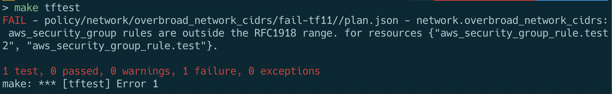
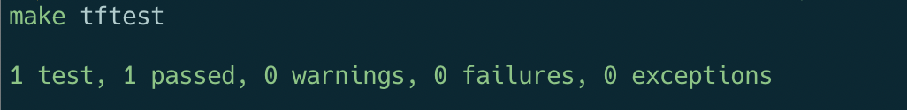

# opa-helper-functions

Standard helper functions to make it easier to write Open Policy Agent policies - especially the more complicated ones that can occur with Terraform.

Current functions include ones for Network CIDR analysis and Terraform.

## Prerequisites

* If using Terraform 0.11.14 policies:

```bash
brew install go
go get github.com/justinm/tfjson2

```

* And finally, install these:

```bash
brew install tfenv
brew install opa
brew install conftest
```

# Functions

## Network CIDR analysis

...write this

## Terraform

...write this

## Example Terraform rule: CIDR analysis of security group rules

### Failing case

```bash
# Fail case
tfenv use 0.11.14
cd policy/network/overbroad_network_cidrs/fail
terraform init
terraform plan -out plan.binary
terraform show -json plan.binary | jq . > plan.json
# Go back to main directory
cd ../../../../
conftest test policy/network/overbroad_network_cidrs/fail/plan.json \
    --policy policy \
    --data policy
```

Alternatively, you can leverage the Makefile that does most of that for you:

```bash
tfenv use 0.11.14
export TF_SUBFOLDER=policy/network/overbroad_network_cidrs/fail-tf11
make tfplan
make tftest
```

* Example output:

> 


### Passing case

```bash
tfenv use 0.11.14
export TF_SUBFOLDER=policy/network/overbroad_network_cidrs/pass-tf11
make tfplan
make tftest
```

* Example output:

> 


## TODO

* Make the Network security group rule for Terraform 0.12 instead of just 0.11
* Add blog post text
