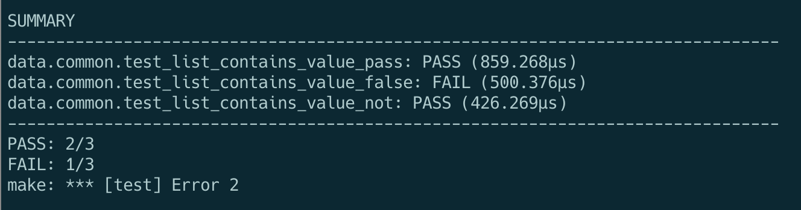
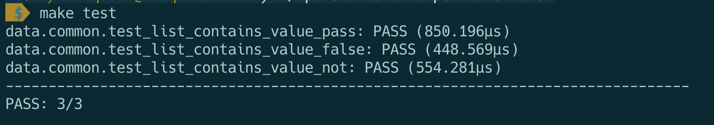

# opa-standard-helper-functions

Standard helper functions to make Rego authoring easier.

## Motivation

I've encountered some serious pain points when writing Rego. I realized I need a central place to stash "tried and true" helper functions as I go along. See the [Example](#example) that covers `list_contains_value` function and why it's important to explicitly call out `false` responses when writing a function.

## Current list of functions

I only have a few here right now. Will add more later.

* `list_contains_value`: Determines if a value is present in a list
* `object_contains_keys`: Determines if an object contains a key
* `object_contains_key_pattern`: Determines any keys in an object match a regex expression

## Example

* `list_contains_value`


Sometimes a function will seem to work for `true` but when you want it to return false, it will return `false` for some cases, but `undefined` in others. What makes matters worse is that you can only uncover that easily via the REPL, as opposed to being able to do that with `opa test`.

For example, let's say you have a function called `list_contains_value` in `common.rego`. The function looks like this:

```rego
list_contains_value(list, item) {
	list_item = list[_]
	list_item == item
}
```

In your `common_test.rego`, you want to create test cases that give you a few responses:
1. A passing case (`list_contains_value(sample_list, "mathers")`)
2. A `not` case (`list_contains_value(sample_list, "biggie")`)
3. A failing case (`list_contains_value(sample_list, "biggie")`)

### 0: Test data

You start out your `common_test.rego` file with this:

```rego
package common

sample_list := [
  "marshall",
  "mathers",
  "haley",
  "kim",
]
```

### 1: A passing case
So, you write your first test case here:

```rego
test_list_contains_value_pass {


	list_contains_value(sample_list, "mathers")
}
```

You run  `make test` and the test passes. Great!

### 2: A `not` case

```rego
test_list_contains_value_not {
	not list_contains_value(sample_list, "eminem")
}
```

You run  `make test` and the test passes. Great! ... or so it seems


### 3: A failing case

Now you try to create a failing case.

```rego
test_list_contains_value_false {
	list_contains_value(sample_list, "biggie") == false
}
```

You run `make test`. And for some reason, it fails!

> 

It turns out that the `not` usage means that OPA will only evaluate to see if the value *is not true* - **it won't actually evaluate to see if it is definitely false**. So, you have to write the function explicitly to allow for `false` responses.

You can do this with the `if/else` statement logic.

Alter `common.rego` to add the additional line starting with `else = false {`:

```rego
package common

list_contains_value(list, item) {
	list_item = list[_]
	list_item == item
}

else = false {
	not list[item]
    not list[item] == false
}
```

This will allow for the `false` response.

Now when you run `make test` it will look like this:

> 

